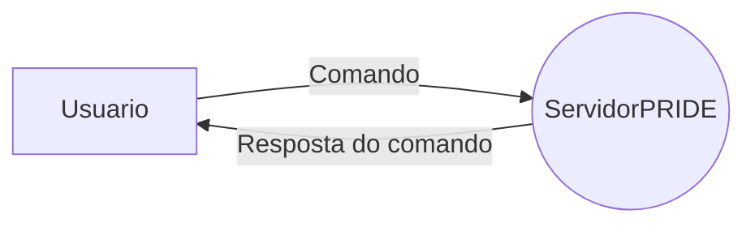
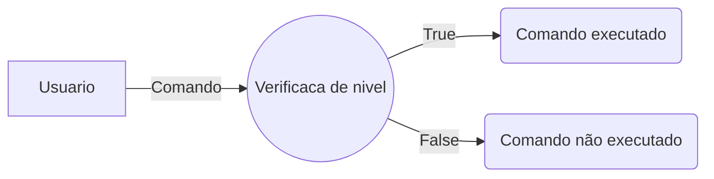
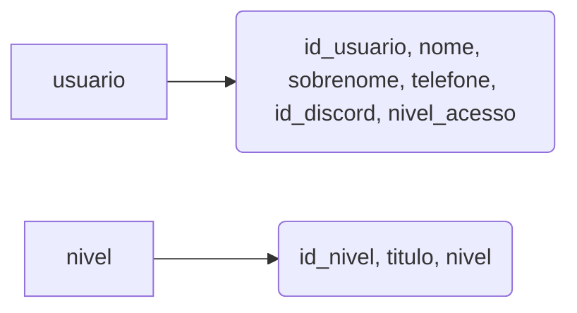
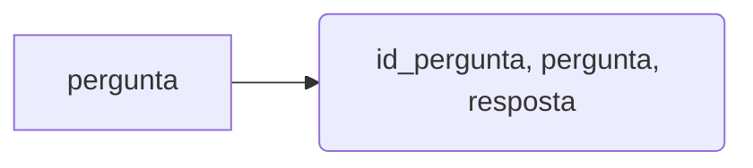
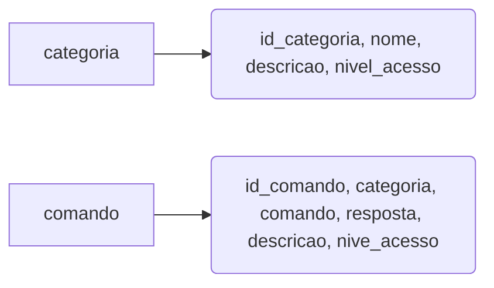
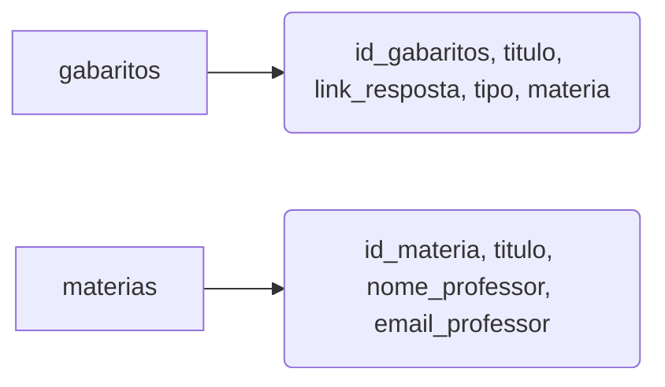
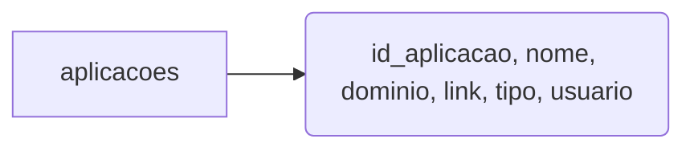
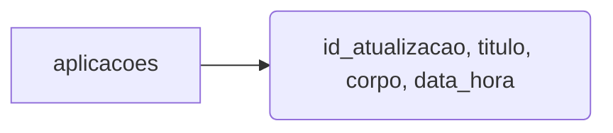
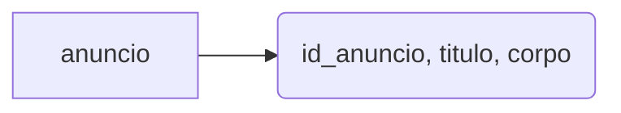

  

# Seja bem vindo!

  

Versão atual do projeto: 0.0.5

  

Olá a todos, tudo bem com vocês? Meu nome é Gustavo, sou o fundador do projeto **PRIDE**, que consiste em desenvolver um BOT para desempenhar diversas funções e consumir diversas APIS diferentes e um banco de dados MySQL.

Em seu escopo original, a finalidade do projeto era um bot com apenas funcionalidades academicas, mas agora ampliei os horizontes e quero explorar até o limite do que um bot pode fazer por nós.

  

Tarefas para execução:

  

- Criar função para verificar que retorne status de registro de usuario , e nivel de acesso.

- Criação de comando de anuncio. heavy_check_mark: - Desenvolvido dia 12/05/2020

- Criação de comando de atualizações. heavy_check_mark: - Desenvolvido dia 12/05/2020

- Atualizar comando "academico".

Atualizacoes :
  

## Escopo atual - Essentials

  

-  **Cadastrar usuário em banco de dados**

  

Apesar da maioria dos comandos contidos aqui neste bot serem livres para todos os usuários, colocarei um filtro para nivel de permissão de usuários pois há alguns comandos que só podem ser visualizados e utilizado por um grupo restrito de usuários.

  

Comando do bot: $root_criar_usuario "Nome" "sobrenome" "Telefone" "ID DISCORD"

  

Status - Registro pelo root (Com opção de escolha para nivel de permissão):heavy_check_mark: - Desenvolvido dia 30/04/2020

  

Status - Registro pelo proprio usuario ( Com nivel de permissão pré definido): :heavy_check_mark: - Desenvolvido dia 30/04/2020

  
  
  

OBS: APÓS O DESENVOLVIMENTO DO MESMO, Será realizada uma atualização para a filtragem de permissão em cada um dos comandos.

  

-  **Respostas**

  

Descrição do endpoint: Após o envio do comando com os parametros corretamente contendo a mensagem a ser respondida, será feito uma consulta no banco de dados buscando a pergunta, e enviando a resposta.

  

Comando do bot: $pride "pergunta"

  

Status: :heavy_check_mark: - Desenvolvido dia 30/04/2020

  

-  **Ajuda**

  

Descrição do endpoint: Após receber o comando de ajuda, sera realizada uma consulta no banco de dados para listar os comandos disponiveis para determinado usuario de acordo com seu nivel de permissao.

  

Comando do bot: $ajuda

  

Status: :heavy_check_mark: - Desenvolvido dia 30/04/2020

**Atualizacoes**

  

Descrição do endpoint: Após receber o comando de ajuda, sera realizada uma consulta no banco de dados para listar as atualizacoes feitas na framework em geral.

  

Comando do bot: $atualizacoes

  

Status: :heavy_check_mark: - Desenvolvido dia 12/05/2020

**Anuncios**

  

Descrição do endpoint: Após receber o comando de ajuda, sera realizada uma consulta no banco de dados para listar os anuncios cadastrados. 

  

Comando do bot: $anuncios

  

Status: :heavy_check_mark: - Desenvolvido dia 12/05/2020

  

## Escopo atual - Hacking

  

-  **Hacking - Whois**

  

Descrição do endpoint: Após o envio do comando com os parametros corretamente contendo o site a ser analisado, usar a library whois para capturar dados referente ao registro de dominio do site.

  

Comando do bot: $hacking_whois "site"

  

Status: :heavy_check_mark: - Desenvolvido

  

## Escopo atual - Watchman

  

-  **Watchman- Alert Webhook**

  

Descrição do endpoint: Será feito o cadastro do usuário ( Caso não exista em nosso discord ) , será feito o cadastro dos sites e dominios do determinado usuário além do link do webhook para alerta. Usando os dados armazenados no banco de dados referentes aos dados cadastrados, será analisado o dominio e o site para verificar se está online, caso esteja offline enviará o alerta no webhook cadastrado no mesmo registro do dominio offline.

  

Comando do bot: $watchman_cadastrar :heavy_check_mark: , $watchman_listar :heavy_check_mark:, $watchman_apagar :heavy_check_mark:.

  

Status: :heavy_check_mark:- Desenvolvido dia 03/05/2020

  

## Escopo atual - Academico

  

-  **Academico - Banco de Trabalhos**

  

Descrição do endpoint: Após o cadastro do usuário no banco de dados e envio do comando pelo usuario, sera realizado uma consulta no banco de dados para retornar todos os registros de respostas de trabalhos contidos no banco de dados.

  

Comando do bot: $academico_trabalhos

  

Status: :heavy_multiplication_x: - Em desenvolvimento

  

## Diagrama lógico de desenvolvimento

-  **Geral**

  

  

-  **Logica de comando**

  

  

**Explicação:** O usuário digitará o comando para o bot, o bot verificará o nivel do usuario que digitou o comando comparando no banco de dados. Se o usuario tiver permissao para usar o comando, o comando sera executado, caso contrário não.

Além da verificação de permissão para execução do comando, através de comparação no banco de usuário será exibido somente o que o usuario tiver permissão para ver.

  
  
  

# Modelagem do banco

  

## Controle de usuarios e nivel de permissão

## Perguntas e respostas

  

  

## Comando de ajuda

  

## Academico

  
  

## Watchman

  
  

## Atualizacoes

  
  

## Anuncios

  
  

  
# Observação

- Este projeto foi desenvolvido com o intuito da criação de um bot que poderia se comunicar com o projeto GOR, entretanto o projeto não foi continuado e nem mesmo o BOT . Caso queira colaborar, as pendencias e ideias estão descritas acima juntamente com a lógica e a documentação do projeto.

## Desenvolvedores

  

Gustavo de Oliveira Rosa
